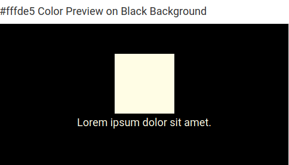
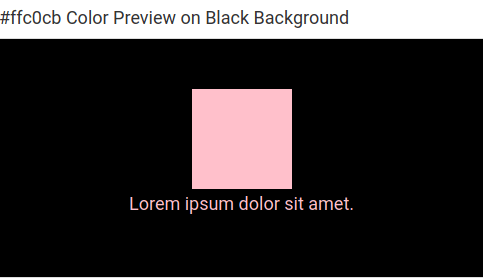
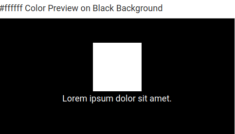
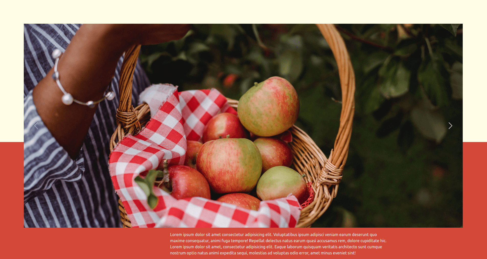

# Maia's Orchard
__[View the live project here](https://chubbyanh.github.io/maias-orchard/)__

  Maia's Orchard is a family owned apple farm in Clonmel, Tipperary, Ireland. The business consists of 100 arces farmland, a farm shop, and a campsite. This website is created as the main marketing channel for the business.

## Table of Contents:
1. [User experience](#user-experience)
    1. [Strategy](#strategy)
    2. [Scope](#scope)
    3. [Structure](#structure)
    4. [Skeleton](#skeleton)
    5. [Surface](#surface)
2. [Features](#features)
    1. [Existing Features](#existing-features)
    2. [Features Left to Implement](#features-left-to-implement)
3. [Technologies Used](#technologies-used)
4. [Testing](#testing)
    1. [UX Stories Testing](#ux-stories-testing)
    2. [Validator Testing](#validator-testing )
    3. [Unfixed Bugs](#unfixed-bugs)
5. [Deployment](#deployment)
    1. [GitHub Pages](#github-pages)
    2. [Forking Repository](#forking-the-github-repository)
    3. [Cloning the project](#cloning-the-project)
8. [Credits](#credits)
    1. [Content](#content)
    2. [Media](#media)
9. [Acknowledgements](#acknowledgements)
10. [Disclaimer](#disclaimer)

## User Experience
### Strategy
  __The business goals of this website are:__
  - To build an online presence
  - To increase engagement with existing customers
  - To get more leads
  - To drive more sales

  __The ideal customers of this website are:__
  - People who want to buy fresh fruit from reliable sources
  - People, especially parents, who want interesting activities for their kids
  - Families/groups who want a get-away camping holiday
  - Tourists looking for things to do in the area

  __The customer goals of this website are:__
  - To find out basic info about the business:
    - What products and services they offer
    - What is in season
    - Directions to the farm
    - How to make a booking
    - How to contact staff
  - To understand the business's core values
  - To seek validation that the products and services are good and worthy

  __This website is the best way to achieve their goals because it provides:__
  - A simple navigation system that helps users browse with ease
  - Information presented with layers through pagination system
  - Information validated by reliable sources: testimonials, certificates, awards
  - Links to events/business activities on social networks
  - Immediate interaction with the business within 1 step

### Scope

### Structure

### Skeleton
  __Wireframes__
  - [Wireframe for mobile](https://balsamiq.cloud/sukw8nh/porgy8r)

### Surface
The main targeted users of this website are families with kids, so I wanted to use colors and fonts that represent warmth, happiness, friendliness, and firmness.
  - __Logo__

  - __Color scheme__

    There are 3 main colors using in this website:

    

    
    
    

    Other than that, I used 2 sub-colors:

    #ffc0cb for hover affect

    

    #ffffff as the alternative of #FFFDE5

    

  - __Fonts__

## Features 
  
### Existing Features
  - __Top banner__
  - __Navigation bar__
  - __Welcome section__
  - __About section__
  - __Activities section__
  - __Contact section__

### Features Left to Implement

- [ ] When users click on "More details" link on the top banner, a callout message box will appear
- [ ] When users click on "Book Your Visit" buttons, they will be redirected to booking pages /or will call the business' phone number directly
- [ ] When users scroll down, the navigation bar will be automatically updated (scrollspy)
- [ ] Reduce page weight and page load time by using [Cloudinary](https://cloudinary.com/) 
- [ ] What's In Season pages
- [ ] Testimonials section, including testimonials, certificates, awards 
- [ ] Live App chat

## Technologies Used
- HTML, CSS, jQuery, [Bootstrap 5](https://getbootstrap.com/docs/5.1/getting-started/introduction/), [Fancybox](https://fancyapps.com/docs/ui/fancybox/), [Google APIs](https://developers.google.com/maps/)
- [GitPod](https://www.gitpod.io/) and [VSCode](https://code.visualstudio.com/) as development environment, [Git](https://git-scm.com/) as Version Control tool
- [GitHub](https://github.com/) to host my code, [GitHub Pages](https://pages.github.com/) to publish the website
- [Balsamig](https://balsamiq.com/) for wireframing
- [Firefox Dev Tool](https://developer.mozilla.org/en-US/docs/Tools) for debugging
- [Google Font](https://fonts.google.com/), [Font Awesome](https://fontawesome.com/), [Hex2rgba](http://hex2rgba.devoth.com/) for styling
- [TinyPNG](https://tinypng.com/), [Canva](https://www.canva.com/), [GIMP](https://www.gimp.org/) for designing, optimizing and editing images
- [Favico](https://favicon.io/) to generate favico image
- [W3.CSS Color Generator](https://www.w3schools.com/w3css/w3css_color_generator.asp) to generate color themes

## Testing 
### Manual Testing
__Transition bug:__

Before fixing

After fixing

### Validator Testing 
__[HTML Validator Testing](https://validator.w3.org/)__

__[CSS Validator Testing](https://jigsaw.w3.org/css-validator/)__

__[Color Contrast Accessibility Validator](https://color.a11y.com/)__

### Unfixed Bugs
This is an incomplete project, so there are still tons of unfixed bugs.

My top priority when I have a chance to work on this again would be responsiveness. Maybe I should revamp the whole website's layout.
## Deployment
### GitHub Pages

The steps to deploy via GitHub Pages:

1. Log into Github account.
2. Navigate to the [Repository](https://github.com/chubbyanh/maias-orchard).
3. Click the 'Settings' option at the top of the repository.
4. Click the 'Pages' option on the left-hand menu, located near the bottom.
5. Within the 'Source' tab Select the drop-down titled 'None'.
6. Select the branch named 'main' (in some cases it can be named 'Master').
7. Click 'Save'.
8. You will be prompted with a URL to your deployed site.
9. Site deployed.

When the above steps have been completed, it can sometimes take a moment for the deployed URL to update. It is enough to refresh the page until the site is fully deployed.

### Forking The GitHub Repository

To use this code and make changes without affecting the original code you can do what is called 'Forking the repository'. By forking this repository you are given a copy of the code at that moment in time that you can use freely. To fork this repository you need to follow the following few steps:

1. Log into your GitHub account.
2. Navigate to the [Repository](https://github.com/chubbyanh/maias-orchard) that you want to fork.
3. In the upper-right of the repository, click the 'Fork' button.
4. A copy of the Repository will now be available within your repositories.

You will now have a copy of the code available to clone and work on without affecting the original code.

### Cloning the Project

To make a local clone of the project follow these steps:

1. Log into your GitHub account.
2. Navigate to the [Repository](https://github.com/chubbyanh/maias-orchard).
3. In the upper section of the repository click the dropdown named 'Code'.
4. Copy the SHH address.
5. Open GitBash
6. Navigate to the correct directory.
7. Create a new directory named 'maias-orchard'.
8. CD into 'maias-orchard'.
9. Enter 'git clone SSH_ADDRESS'
10. GitBash will clone the repository into this directory.
11. Enter 'code .' and this will open VS CODE and happy coding.

__[The live link can be found here](https://chubbyanh.github.io/maias-orchard/)__

## Credits
### Content
- Business idea was inspired by a [real business in Tipperary - The Apple Farm](https://www.theapplefarm.com/), that I am a regular customer of.
- The [Deployment](#deployment) section of README.md file was forked from [my classmate's README.md file - Katarzyna Zurawska](https://github.com/katzur/cork-swap/blob/main/README.md)
- The website's general design was inspired by [this template on Wix](https://www.wix.com/website-template/view/html/2690)
- Bootstrap 5 and Fancybox's templates were taken from [my mentor's Carousel templates](https://guidocecilio.github.io/ci-m1-bootstrap-template/)

### Media
- Image [Staff selling apple](https://pikwizard.com/photo/smiling-female-staff-holding-a-basket-of-green-apple-at-supermarket/edf79671f221bc69fb2f3d92c26b9bba): free license from Pikiwizard
- Image [Berries](https://pixabay.com/photos/berries-fruits-food-blackberries-2277/): free license from Pizabay
- Image [Apple blossom](https://pixabay.com/photos/blossom-embellishment-raindrop-4118336/): free license from Pizabay
- Image [Hand holding apple basket](https://www.pexels.com/photo/ethnic-woman-picking-apples-in-basket-5528994/): free license from Pexels
- Other images: purchased from [Shutterstock](https://www.shutterstock.com/)

## Acknowledgements
  - I would like to thank my mentor, [Guido Cecilio](https://github.com/guidocecilio), for his support throughout my project. It is unfortunate that due to my personal circumstances, I couldn't complete this project on time, but I defenitely learnt a lot from him after every mentoring sessions.
  - I also would like to thank my classmates (msletb-nov-2021 cohort) at Code Institute and Kasia Bogucka, our corhort's facilitator, for their continuing support.

## Disclaimer
  Maia's Orchard is an imaginary business. This website is created for educational purposes only.